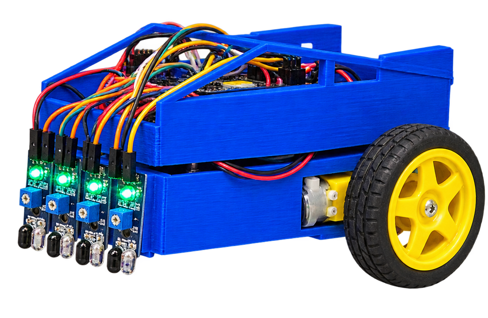
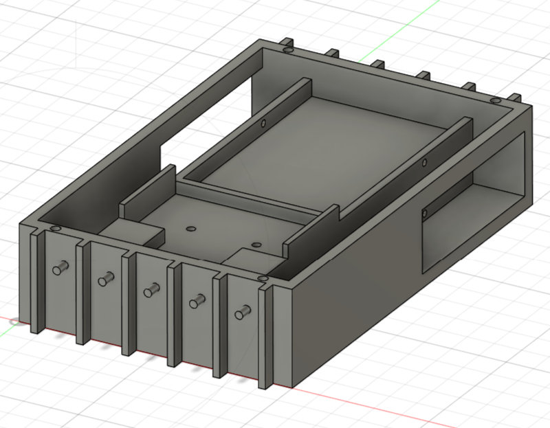
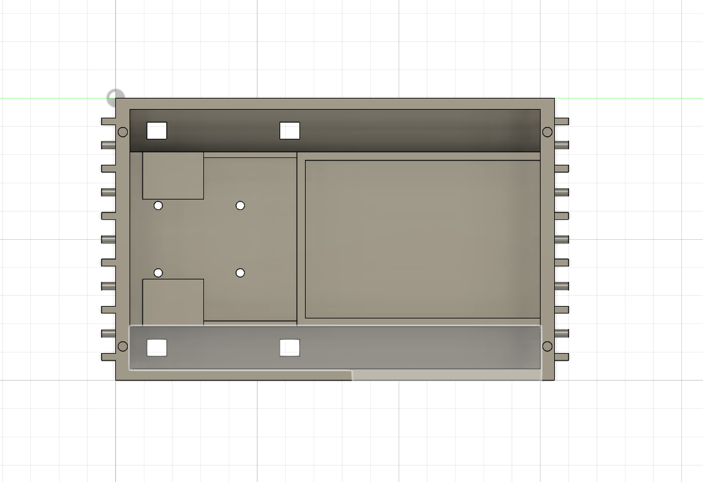

# Autonomous Line-Following Robot

Low-cost autonomous line-following robot developed as a University of Toronto ECE summer research project, funded by the First Year Summer Research Fellowship.

  

## Overview

The original platform used four continuous-rotation servos. I redesigned it around:

- 2 DC geared motors
- L298N motor driver
- 5-sensor IR array
- passive caster wheel
- custom 3D-printed chassis
- PWM-based steering control

The main design changes were the drivetrain, chassis geometry, caster mounting, and IR sensor placement.

## CAD

  
  &nbsp;&nbsp;
  

Final CAD files:

- [`chassis_final.step`](cad/chassis_final.step)
- [`chassis_final.stl`](cad/chassis_final.stl)

## Firmware

The five IR sensors are used to determine the robot's position relative to the line. Motor speeds are adjusted independently using PWM for left/right steering corrections.

Final code: [`line_follower.ino`](firmware/line_follower.ino)

## Testing

Four chassis/sensor configurations were tested with **25 trials each (100 total)**.

| Sensor distance | Chassis | Result |
|---|---|---:|
| 16 mm | Tilted | 7/25 — 28% |
| 16 mm | Level | 13/25 — 52% |
| 139 mm | Tilted | 23/25 — 92% |
| 139 mm | Level | **24/25 — 96%** |

The longer **139 mm sensor look-ahead** produced the largest improvement. The best configuration completed **24/25 trials successfully**.

Raw results: [`trial_results.csv`](testing/trial_results.csv)

## Research Poster

[View the project poster](docs/research_poster.pdf)

Supervised by Professor Hamid Timorabadi, Department of Electrical and Computer Engineering, University of Toronto.
